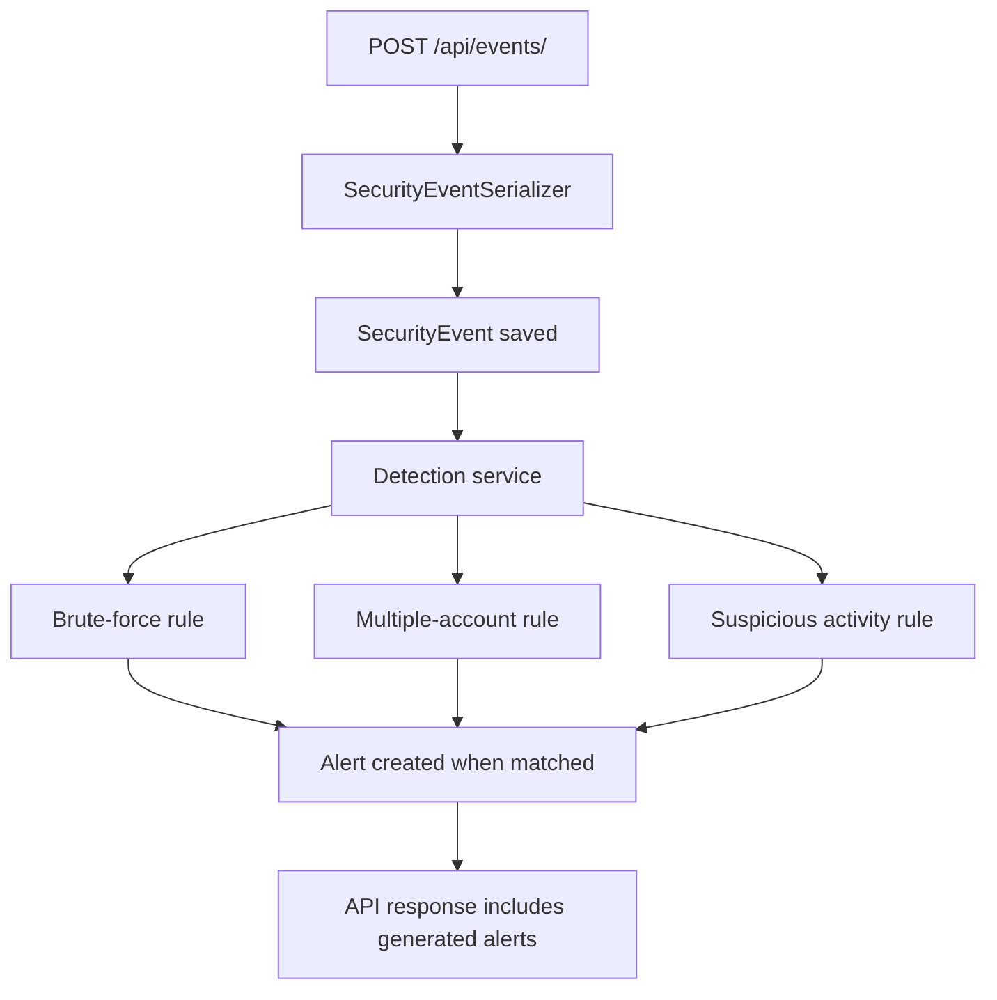

# ThreatWatch

ThreatWatch is a small Django REST Framework API for collecting authentication and security events, analyzing them with deterministic rules, and creating security alerts for suspicious behavior.

It is designed as a focused backend portfolio project for a cybersecurity software engineering internship. The implementation stays intentionally small: SQLite storage, two core models, explainable rule-based detection, API endpoints, tests, and demo data.

## Features

- Store authentication and security events.
- Detect brute-force login attempts.
- Detect one IP targeting multiple accounts.
- Detect high-volume suspicious activity.
- Assign deterministic risk scores and severity levels.
- Prevent repeated duplicate alerts during a cooldown window.
- List events and alerts through a REST API.
- Filter alerts by type, severity, or IP address.
- Generate demo data for interview walkthroughs.

## Architecture



Business logic lives in `security/detection.py` and `security/services.py`. Views stay thin and focus on request and response handling.

## Detection Rules

| Rule | Alert Type | Threshold |
| --- | --- | --- |
| Brute force | `BRUTE_FORCE` | At least 5 `LOGIN_FAILED` events from the same IP within 5 minutes |
| Multiple-account targeting | `MULTIPLE_ACCOUNTS` | `LOGIN_FAILED` events from the same IP against at least 3 usernames within 10 minutes |
| Suspicious activity | `SUSPICIOUS_ACTIVITY` | At least 10 security events from the same IP within 10 minutes |

Duplicate prevention uses a 10-minute cooldown for alerts with the same alert type and IP address.

## Risk Scoring

ThreatWatch uses deterministic scoring:

| Signal | Score |
| --- | ---: |
| Repeated failed login attempt | `+10` each |
| Multiple account targeting | `+20` |
| Brute force detected | `+50` |
| Suspicious activity | `+30` |

Severity is derived from the final score:

| Score | Severity |
| ---: | --- |
| `0-29` | `LOW` |
| `30-59` | `MEDIUM` |
| `60-89` | `HIGH` |
| `90+` | `CRITICAL` |

## API Endpoints

### Create Event

`POST /api/events/`

```json
{
  "ip_address": "192.168.1.10",
  "username": "admin",
  "event_type": "LOGIN_FAILED",
  "timestamp": "2026-08-10T15:30:00Z"
}
```

Response:

```json
{
  "event": {
    "id": 1,
    "ip_address": "192.168.1.10",
    "username": "admin",
    "event_type": "LOGIN_FAILED",
    "timestamp": "2026-08-10T15:30:00Z",
    "created_at": "2026-08-10T15:30:01Z"
  },
  "generated_alerts": []
}
```

### List Events

`GET /api/events/`

Returns paginated security events.

### List Alerts

`GET /api/alerts/`

Optional filters:

- `?severity=HIGH`
- `?alert_type=BRUTE_FORCE`
- `?ip_address=192.168.1.10`

### Alert Summary

`GET /api/alerts/summary/`

```json
{
  "total_alerts": 12,
  "low_severity": 3,
  "medium_severity": 5,
  "high_severity": 4,
  "critical_severity": 0,
  "brute_force": 6,
  "multiple_accounts": 4,
  "suspicious_activity": 2
}
```

## Installation

```bash
git clone <repository-url>
cd ThreatWatch

python3 -m venv venv
source venv/bin/activate

pip install -r requirements.txt
python manage.py migrate
```

For Windows:

```bash
venv\Scripts\activate
```

## Demo Data

Create realistic sample events and alerts:

```bash
python manage.py seed_demo
```

The demo data includes normal login activity, a brute-force attack, multiple-account targeting, and suspicious high-volume activity. It uses private/example IP addresses only.

## Running the API

```bash
python manage.py runserver
```

Open:

- `http://127.0.0.1:8000/api/events/`
- `http://127.0.0.1:8000/api/alerts/`
- `http://127.0.0.1:8000/api/alerts/summary/`

## Example Usage

Create one event:

```bash
curl -X POST http://127.0.0.1:8000/api/events/ \
  -H "Content-Type: application/json" \
  -d '{
    "ip_address": "192.168.1.10",
    "username": "admin",
    "event_type": "LOGIN_FAILED",
    "timestamp": "2026-08-10T15:30:00Z"
  }'
```

List alerts:

```bash
curl http://127.0.0.1:8000/api/alerts/
```

Filter high-severity alerts:

```bash
curl "http://127.0.0.1:8000/api/alerts/?severity=HIGH"
```

View alert summary:

```bash
curl http://127.0.0.1:8000/api/alerts/summary/
```

## Running Tests

```bash
pytest
```

The test suite covers model creation, validation, detection rules, duplicate prevention, API endpoints, filtering, and invalid input handling.

## Configuration

ThreatWatch reads these optional environment variables:

- `DJANGO_SECRET_KEY`
- `DJANGO_DEBUG`
- `DJANGO_ALLOWED_HOSTS`

The default settings are for local development only.

## Future Improvements

These are intentionally not implemented in the current scope:

- Authentication and role-based access.
- PostgreSQL for production-style persistence.
- Redis-based rate limiting.
- Background event processing.
- Real-time alert streaming.
- More sophisticated detection rules.
- SIEM integrations.
- IP reputation services.
